# ⭐book-mark-server
Mobile, Tablet, Desktop, Public PC 등 다양한 환경에서 자신만의 즐겨찾기를 이용하기 위해 개발하였습니다.

<br>

해당 프로젝트의 Back-End 부분입니다.

<br>

## ⚙Environment
- Express 4.16.1

<br>

## 🛠Library
- mysql2

<br>

## 📃ERD 설계


<br>

## ✔핵심 기능
(작성 예정)

<br>

## ❗트러블 슈팅
<details>
<summary>상세 내용 확인</summary>
<div markdown="1">

div 에 markdown attribute 를 1 로 
하는 이유는 div 안에서
markdown 을 사용하기 위해서 입니다.


</div>
</details>

<br>

## 📝리팩토링

### 1. REST API 적용
|변경 전|변경 후|
|:-------:|:-------:|
|post + registerUser|post + user|
|post + updateUser|put + password|
|post + deleteUser|put + user|
|post + bookmark|post + bookmarks|
|post + createBookmark|post + bookmark|
|post + editBookmark|put + name-address|
|post + deleteBookmark|put + bookmark|
|post + updateStar|put + star|


<br>

## 💻Usage
```
├── book-mark
│   └── bookmark (FE development)
└── book-mark-server
    └── server (BE development)
        └── db
            └── config.js (Database Setting file)
``` 
**이용하시기 위해선 [book-mark](https://github.com/wogha95/book-mark)와 [book-mark-server](https://github.com/wogha95/book-mark-server)가 필요합니다.**

1. 빈 폴더에 [book-mark](https://github.com/wogha95/book-mark)와 [book-mark-server](https://github.com/wogha95/book-mark-server)를 clone합니다.
2. book-mark-server/server/db/config.js 작성합니다.
3. config.js과 동일하게 Mysql DB connection을 생성합니다.
4. ERD 설계와 동일하게 table을 생성합니다.
5. book-mark/bookmark 에서 `npm run build` 실행
6. book-mark-server/server 에서 `npm start` 실행
7. 브라우저 주소창에 `localhost:3000` 으로 접속

<br>

## 📸실행 화면
|                 | Mobile | PC |
|:---------------:|--------|----|
| login           |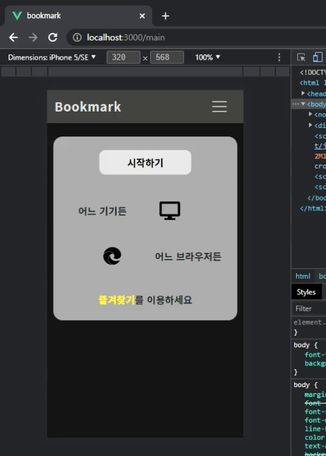||
| create User     |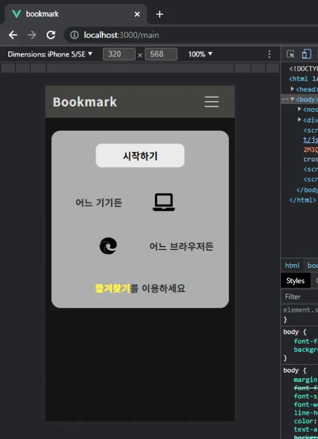|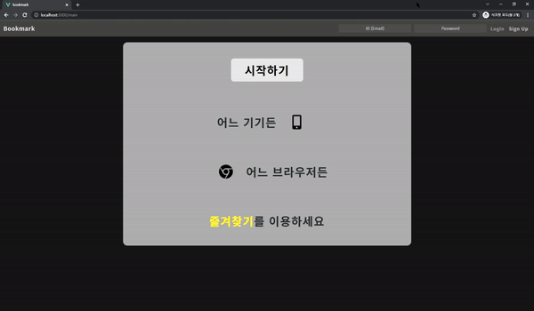|
| update User     |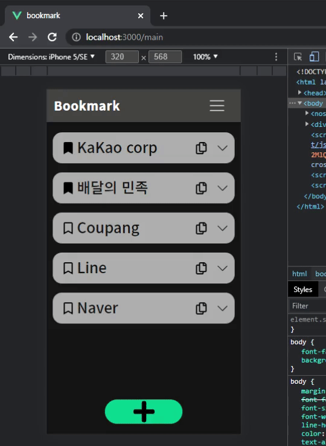|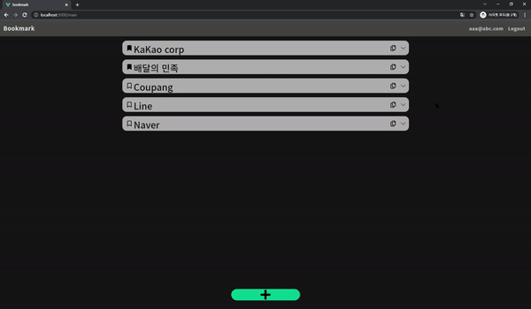|
| delete User     |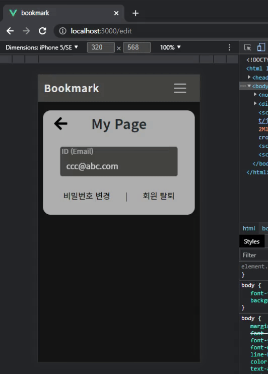|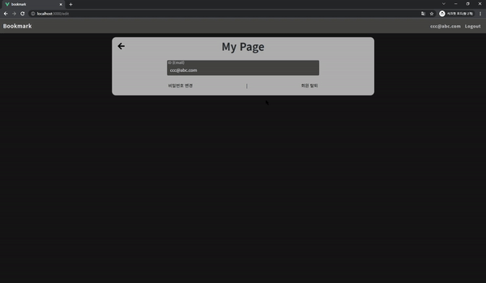|
| create Bookmark ||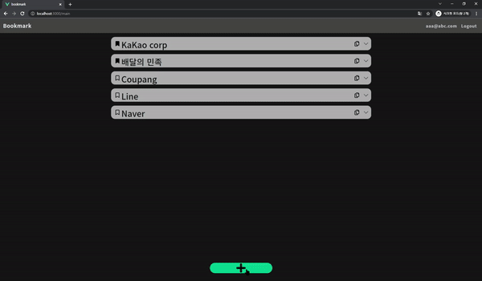|
| update Bookmark |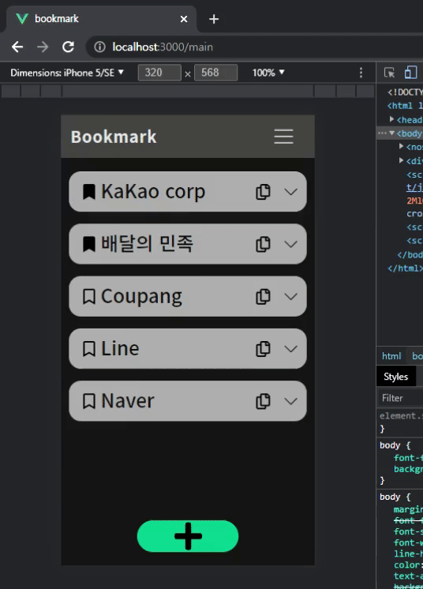|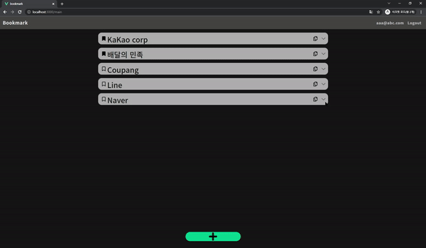|
| delete Bookmark |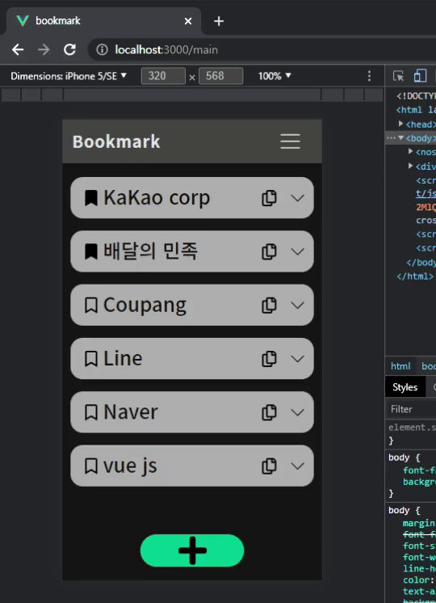|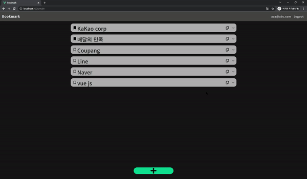|
| update Star     |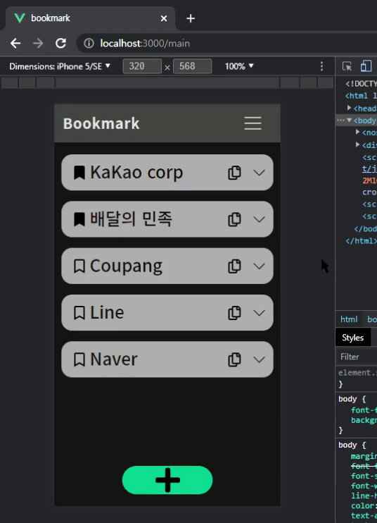|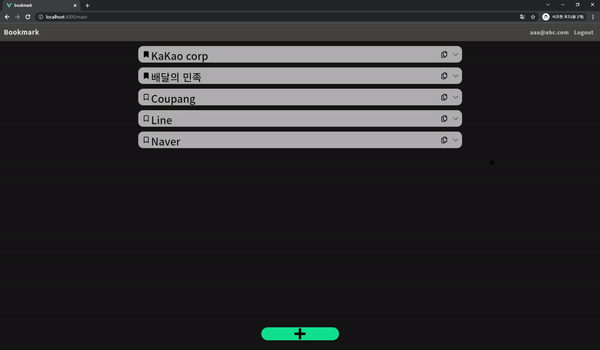|

<br>
